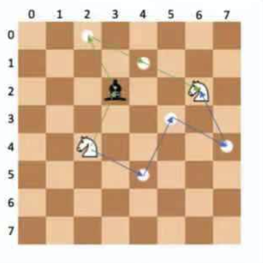
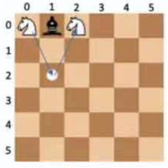

# Knights Path  
 Given a chess  board of n row (top to bottom) and n columns (left and right).  
 In each move, a knight moves either:
 * 2 column positions and 1 row position
 * 2 row positions and 1 column position
 
 In other words, a move is 2 steps along one axis and 1 step along a perpendicular axis.  
   
 A bishop, on the other hand, moves any number of steps diagonally.  
   
 Both the knight and bishop capture any piece that is on a position that it moves to. A position  
 that a piece can move to is said to be threatened by that piece, because if another piece  
 moves to that position, then it can be captured.  
   
 Given a starting position A and ending position B for the knight, and a bishop position C,  
 calculate the minimum number of moves needed by the knight to move from A to B while  
 avoiding all positions threatened by the bishop. if the knight captures the bishop on one of  
 its moves, then it can move into positions that were previously threatened by the bishop. If  
 there is no possible path to B, return -1. All moves must remain within the chess board.The  
 knight may move to B even if B is threatened by the bishop.  
   
 Example  
 n = 8  
 startRow = 4  
 startCol = 2  
 endRow = 2  
 endCol = 6  
 bishopRow = 2  
 bishopCol = 3  
   
 The chess board has a size of 8 x 8. 
    
 + Start at the position (startRow, startCol) = (4,2), **trying to get to end position (endRow,endCol) = (2,6)**
 + There are two possible paths of length 4 moves.
    * The first path, in blue, goes form(4,2) to (5,4) to (4,7) to (2,6), avoiding all squares threatened by the bishop.
    * The second path, in green, first goes from (4,2) to (2,3), capturing the bishop. Then,it goes from (2,3) to (0,2) to (1,4), which is no longer threatened by the bishop, to (2,6).
    

## Function Description
Complete the function moves in the editor below.        
*moves* has the *following parameters:*

     int n: the width and height of the square board
     int startRow: the row of the starting location
     int startCol: the column of the starting location
     int endRow: the row of the target location
     int endCol: the column of the target location
    int bishopRow: the row of the bishop's location
    int bishopCol: the column of the bishop's location

Returns:  

    int: a single integer that denotes the number of moves required or -1 if it is not possible to reach the target location.
    
##Constraints

* 
* 

## Input Format For Custom Testing
The first line of input contains an integer n.  
The next 6 lines contain the integer values startRow,startCol,endRow,endCol,bishopRow and bishopCol.

## Sample Case 0
### Sample Input For Custom Testing

|    STDIN   |    Function      |
|  --------  | ---------------  |
| ---------  | ---------------  |
|      6     |   n = 6          |
|      0     |   startRow = 0   |
|      0     |   startCol = 0   |
|      0     |   endRow = 0     |
|      2     |   endCol = 2     |
|      0     |   bishopRow = 0  |
|      1     |   bishopCol = 1  |

### sample Output
2

### Explanation
The chessboard is of size 6 x 6.  

* Start at the position (0,0)
* Move 2 steps down and 
